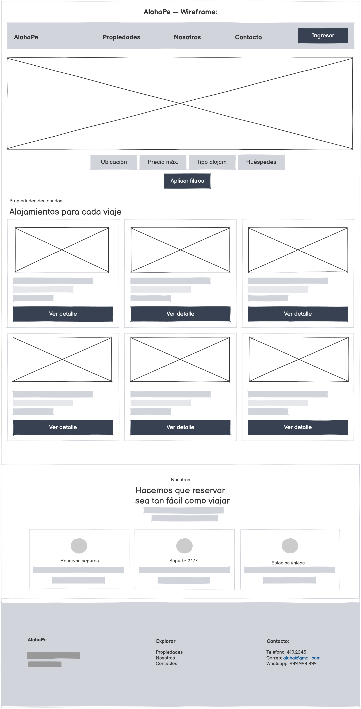
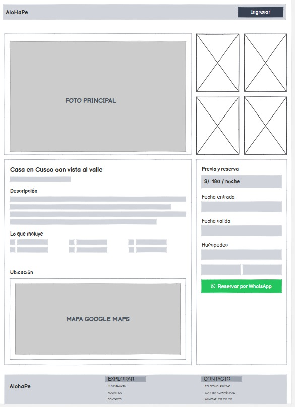
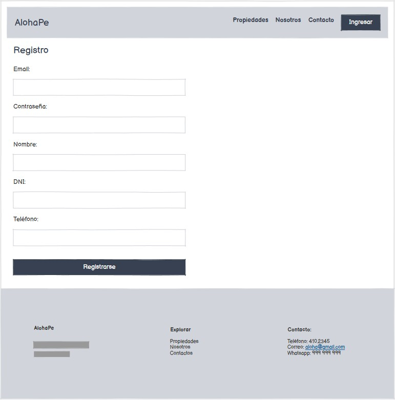
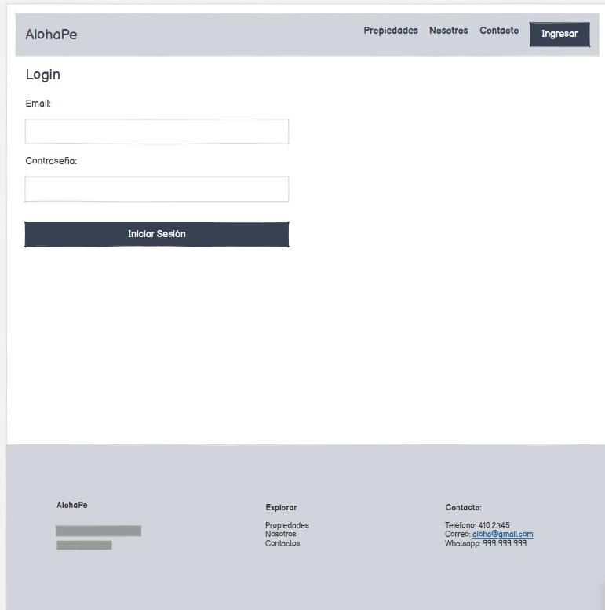
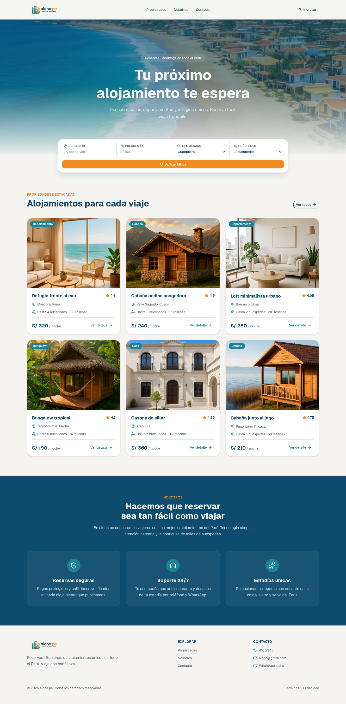
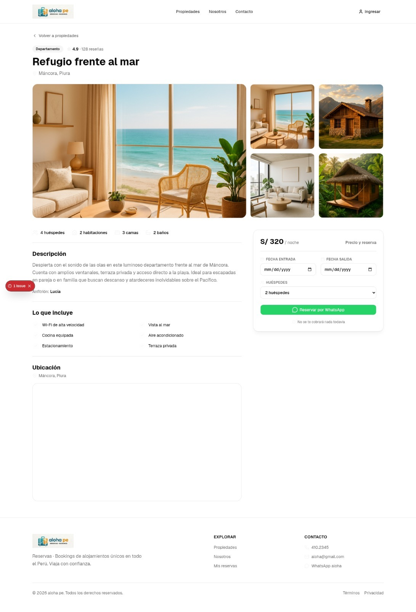
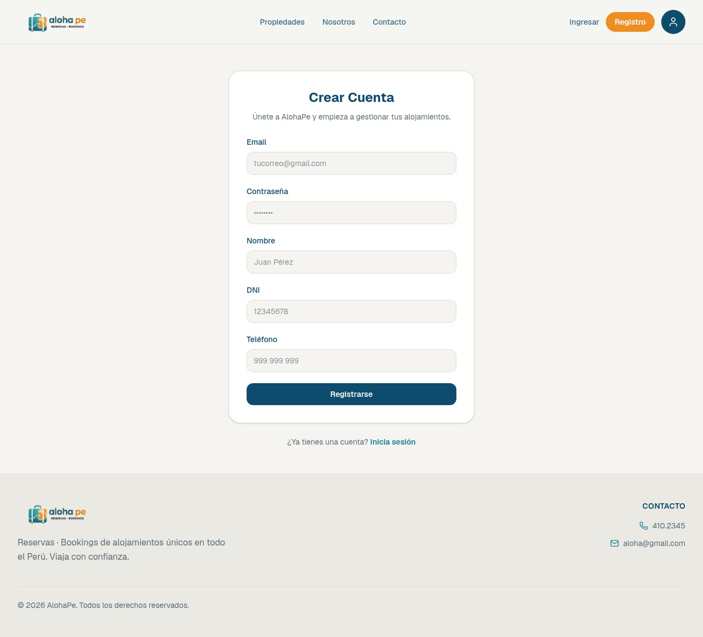
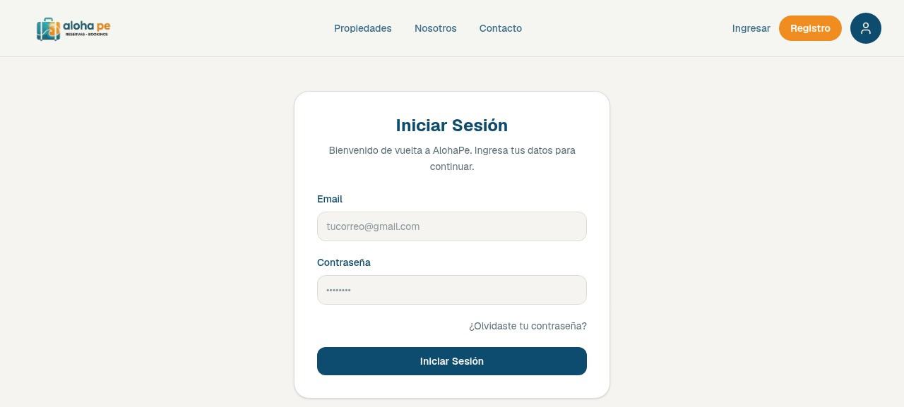
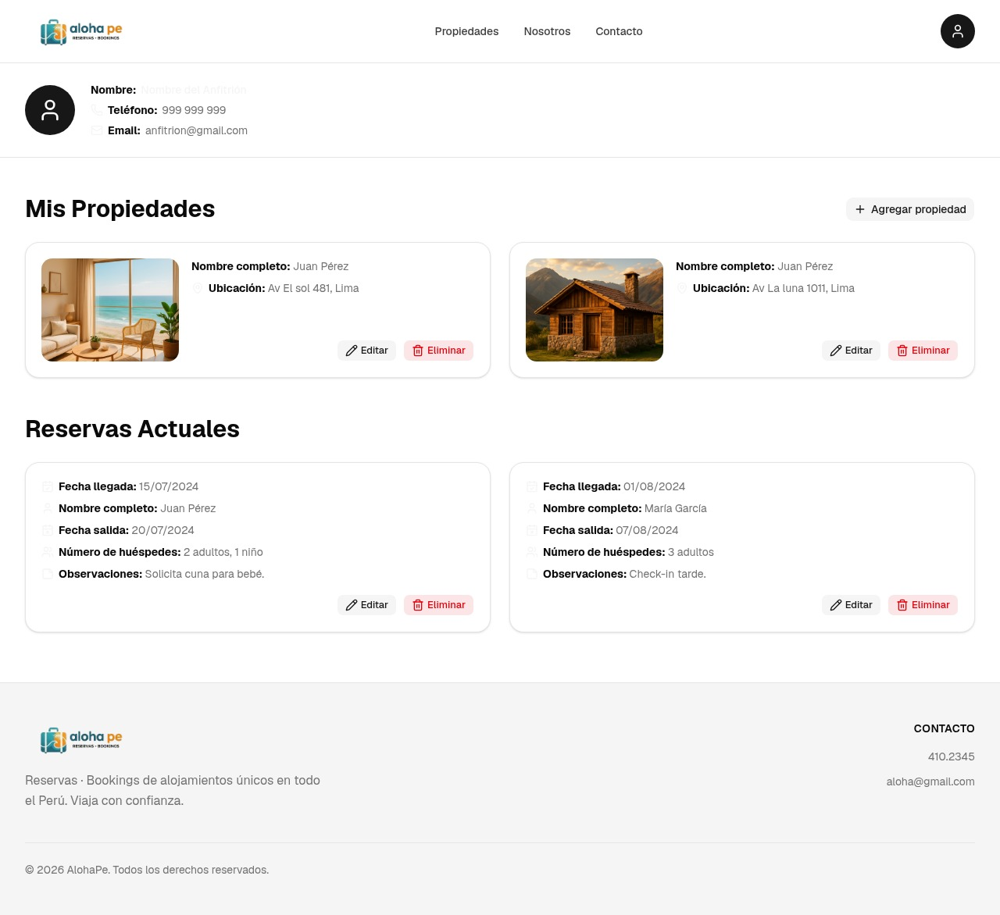

# Aloha

Proyecto web con HTML, Bootstrap 5 y CSS.

## Estructura

```
projecto/
├── index.html
├── css/
│   └── styles.css
└── images/
```

## Tecnologías

- HTML5
- Bootstrap 5.3.3
- CSS3
- Git

### Wireframes

#### Baja






#### Alta




